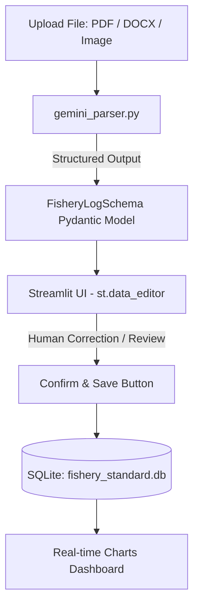

# Implementation Plan - Diverse Fishery Information Standard and Intelligent System (DFIS) Prototype

This document outlines the design and implementation plan for building a Streamlit-based prototype of the **Diverse Fishery Information Standard and Intelligent System (多元漁業資訊標準及智慧化系統)**.

## User Review Required

> [!IMPORTANT]
> Since the exact code/specification for `FisheryLogSchema` was not found in the local workspace or conversation history, I have proposed a standard schema definition below. Please review the schema structure and let me know if any fields need to be added, renamed, or modified.

## Open Questions

> [!NOTE]
> 1. **Gemini API Key**: I will design the Streamlit app to look for the `GEMINI_API_KEY` (or `GOOGLE_API_KEY`) environment variable, but also provide a text input field in the sidebar for ease of use. Is this acceptable?
> 2. **Pydantic Schema Fields**: Does the proposed `FisheryLogSchema` cover all fields you expect to extract from the fishery reports? (See proposed schema in `schema.py` below).

---

## Proposed Architecture & Component Design

The system will consist of four main components:
1. **Schema Definition (`schema.py`)**: Defines the data structures using Pydantic.
2. **Database Manager (`db_manager.py`)**: Handles SQLite initialization, record insertion, and data retrieval.
3. **AI Parsing Engine (`gemini_parser.py`)**: Extracts information from PDF, Word (.docx), and images using Gemini Structured Outputs.
4. **Streamlit Application (`app.py`)**: The interactive web interface, styling, data editor, and visualization dashboard.



---

## Proposed Changes

### 1. Data Schema
#### [NEW] [schema.py](file:///c:/Users/azwer/OneDrive/文件/DFIS多元漁業資訊標準及智慧化軟體系統/schema.py)
Defines the structure for structured Gemini extractions and validation.

```python
from pydantic import BaseModel, Field
from typing import List

class FishCatch(BaseModel):
    original_name: str = Field(..., description="魚種在報表中的原始名稱，例如：白帶、扁實鰹")
    standard_name: str = Field(..., description="校正後的標準魚種名稱，例如：肥帶鰏、小東方鰹")
    weight: float = Field(..., description="捕獲重量（公斤，kg）")
    dynamic_properties: str = Field(default="", description="動態屬性，例如：規格、單價、箱數、體長或備註")

class FisheryLogSchema(BaseModel):
    vessel_name: str = Field(..., description="漁船名稱")
    fishing_date: str = Field(..., description="作業日期 (格式: YYYY-MM-DD)")
    fishing_method: str = Field(..., description="作業漁法，例如：延繩釣、流刺網、拖網等")
    fishing_area: str = Field(..., description="作業海域/漁區，例如：FAO61、彭佳嶼海域等")
    catch_list: List[FishCatch] = Field(..., description="捕獲魚種明細清單")
```

---

### 2. Database Layer
#### [NEW] [db_manager.py](file:///c:/Users/azwer/OneDrive/文件/DFIS多元漁業資訊標準及智慧化軟體系統/db_manager.py)
Handles communication with the local SQLite database (`fishery_standard.db`).

- **`init_db()`**: Sets up `fishery_logs` and `fish_catches` tables with foreign keys.
- **`save_fishery_log(log_data: dict)`**: Inserts a log record and its associated species catch entries in a transaction.
- **`get_visualization_data()`**: Fetches aggregated yield data per fish species and proportion of fishing methods.

---

### 3. Extraction Layer
#### [NEW] [gemini_parser.py](file:///c:/Users/azwer/OneDrive/文件/DFIS多元漁業資訊標準及智慧化軟體系統/gemini_parser.py)
Integrates with the Gemini SDK to process inputs:
- Reads PDFs using `pypdf`.
- Reads Word documents (`.docx`) using `python-docx`.
- Processes images directly as base64/bytes.
- Uses `gemini-2.0-pro-exp` or `gemini-1.5-pro` with Structured Outputs via Pydantic schema validation.

---

### 4. Presentation Layer
#### [NEW] [app.py](file:///c:/Users/azwer/OneDrive/文件/DFIS多元漁業資訊標準及智慧化軟體系統/app.py)
Builds the user interface:
- **Styling**: Sleek dark mode / ocean-themed layout with CSS variables, rich typography, smooth hover transitions, and cards.
- **File Uploader**: Drag-and-drop file upload.
- **Review Section**:
  - Displays basic log metadata in editable text inputs.
  - Displays the catch species list in `st.data_editor` allowing column additions, cell edits, and deletion.
- **Action Button**: A large styled button "確認無誤，落庫保存" (Confirm and save to database) that saves to SQLite.
- **Dashboard Section**: Displays aggregated statistics using Plotly Express:
  - Vertical/horizontal bar chart of total yield (kg) by standard fish species.
  - Pie/donut chart of fishing method shares.

---

## Verification Plan

### Automated/Unit Tests
We will verify dependencies and basic functionality:
- Run a verification script `test_system.py` to test the SQLite database connection, inserts, and queries.
- Mock the Gemini API response using local sample data to test the integration and Streamlit components locally without consuming API credits unnecessarily.

### Manual Verification
1. Launch the Streamlit application: `uv run streamlit run app.py`
2. Test uploading files (images, docx, PDFs).
3. Verify that the extracted data displays properly in the inputs and `st.data_editor`.
4. Modify values in the editor.
5. Click "確認無誤，落庫保存" and verify that database tables update in `fishery_standard.db`.
6. Inspect the Plotly charts at the bottom of the page to ensure they update in real-time.
